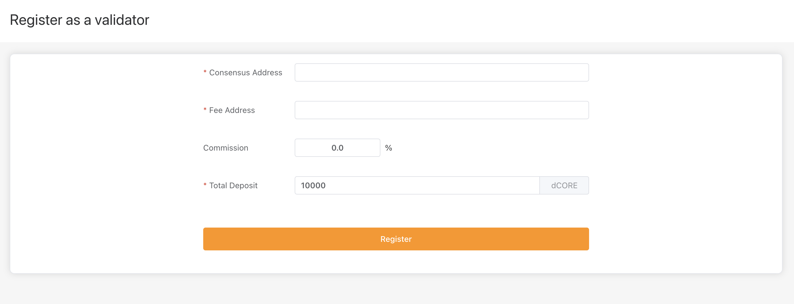

# Validator Registration

## Technical Whitepaper

Before becoming a validator on Core, we strongly recommend reading the [Technical Whitepaper](https://docs.coredao.org/).

## Registration

To register as a validator on Core you must be running a full node in validator mode. Please read [our guide](https://docs.coredao.org/developer/become-a-validator/validators/core-full-nodes) for information on how to set this up.

Once that’s finished, the easiest way to register a new validator is using one of our staking websites:

* [Mainnet stake website](https://stake.coredao.org)
* [Testnet stake website](https://stake.test.btcs.network)

Connect your wallet by selecting **Connect Wallet** in the top right. Once connected, the **register** button should appear on the top right. Selecting **register** opens the following input form:

<figure><figcaption></figcaption></figure>

Provide information for each of the form's fields:

* **Consensus address**: the validator address you set when you initialized your validator full node.
* **Fee address**: the address used to collect commission fees.
* **Commission**: revenue is split between the validator and its delegators, with the commission determining what percentage of delegator revenue is taken by the validator as compensation.
* **Total deposit**: the refundable CORE deposit locked up while performing validator services. On testnet, the minimum amount is 10,000 CORE.

Once you've entered the required information, select **register** to register as a validator.

## Confirm Registration

A quick way to check that you've successfully registered your full node as a validator is to open the log file and search for the error message "unauthorized validator". This error occurs when this node is registered as a validator but not yet elected to the validator set.

<figure><figcaption></figcaption></figure>

## Validator Election

Each day, the 21 validators with the highest hybrid scores are elected to the validator set, thereby becoming responsible for producing blocks on the Core network for the entirety of the round. When the last block of a round is mined, the round’s accumulated rewards are distributed and the next round's validator set is selected. For more details about how the validator election works, refer to the[ validator election](https://docs.coredao.org/satoshi-plus-consensus/validator-election) section of the Technical Whitepaper.

You can check the validator status on the stake website, active elected validators will be marked as `Active/Normal`. The validator set is updated at 00:00 am UTC every day.

<figure><figcaption></figcaption></figure>

Validators are assigned a status based on their actions during and before the current round:

<table><thead><tr><th width="208">Validator Status</th><th>Description</th></tr></thead><tbody><tr><td>Active/Normal</td><td>Elected validator in the current round. Qualified for the next election.</td></tr><tr><td>Active/Refuse</td><td>Elected validator in the current round, but refused to accept delegation. Not qualified for the next election.</td></tr><tr><td>Active/Jailed</td><td>Elected validator in the current round, but jailed due to a felony. Not qualified for the next election.</td></tr><tr><td>Inactive/Queued</td><td>Registered, but not elected. Qualified for the next election.</td></tr><tr><td>Inactive/Refuse</td><td>Registered, but refused to accept delegation. Not qualified for the next election.</td></tr><tr><td>Inactive/Jailed</td><td>Registered, in jail. Not qualified for the next election.</td></tr><tr><td>Inactive/Locked</td><td>Registered, But not enough deposit. Not qualified for the next election.</td></tr><tr><td>Inactive/Invalid</td><td>Unregistered.</td></tr></tbody></table>

You can search a validator's consensus address on[ Core Scan](https://scan.coredao.org/) to see their record of producing blocks.

<figure><figcaption></figcaption></figure>

## Rewards

Validators receive rewards for producing a block from two sources:

1. Block rewards: newly minted CORE allocated to the block producer.
2. Transaction fees: fees paid by the senders of transactions included in the block. &#x20;

Validators are required to share rewards with the delegators who staked CORE or delegated hash power to them. Given the fact that each validator has an equal probability of producing blocks, all stable validators should get a similar portion of the rewards, in the long run. The portion validators keep for themselves (commission fees) will be distributed directly to their fee addresses at the end of each round. For more details about rewards, please visit the[ rewards](https://docs.coredao.org/satoshi-plus-consensus/rewards) section of the Technical Whitepaper.

## Preventing Validator Misbehavior

Malicious validator behavior is disincentivized by slashing and jailing. Verifiers can submit evidence to have validators slashed or jailed if they fail to meet their obligations. The primary slashable activities are unavailability and double signing. Unavailability is reported by validators themselves in the consensus algorithm, and double signing is reported by external verifiers.
