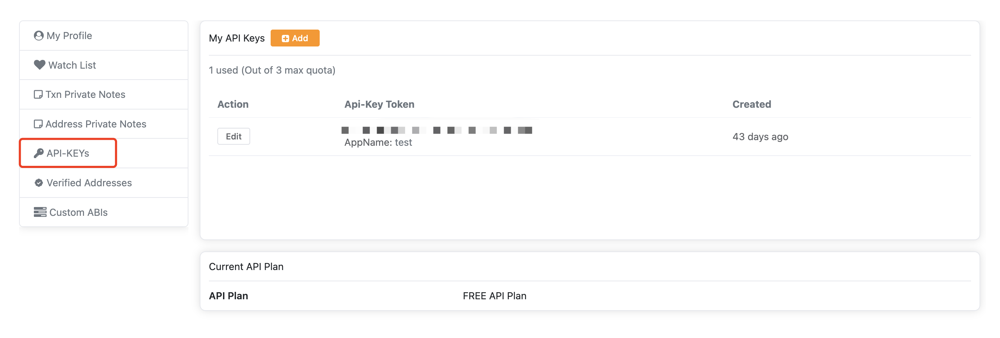
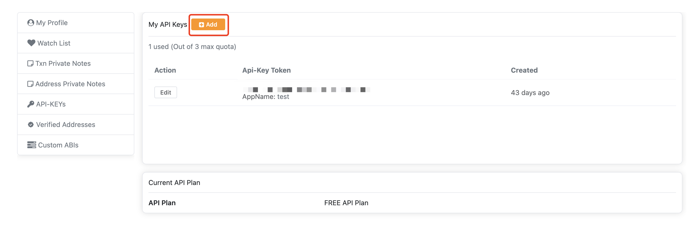
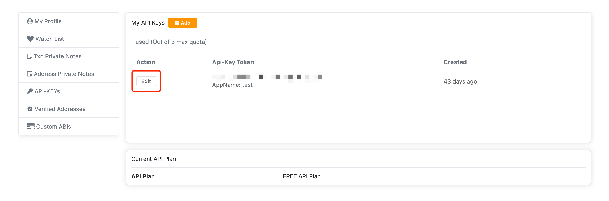

# Generate an API Key

## Creating an API Key

From your [Account Dashboard](https://scan.coredao.org/my/account), click on the navigation tab labeled 🗝 **API-KEYs**.

<figure><figcaption></figcaption></figure>

From there, you may click on **Add** to create a new key and give a name to your project. Each CoreScan account is limited to creating three keys at any one time.

<figure><figcaption></figcaption></figure>

## Editing an API Key

To change the project name associated with an API Key, click **Edit**, specify a new App Name, and save the changes.

<figure><figcaption></figcaption></figure>
