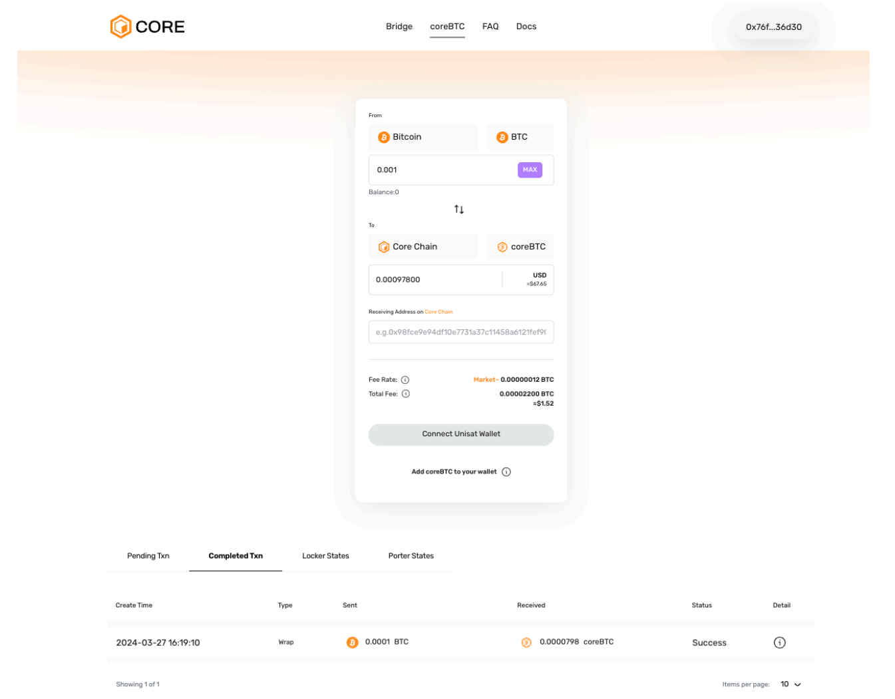
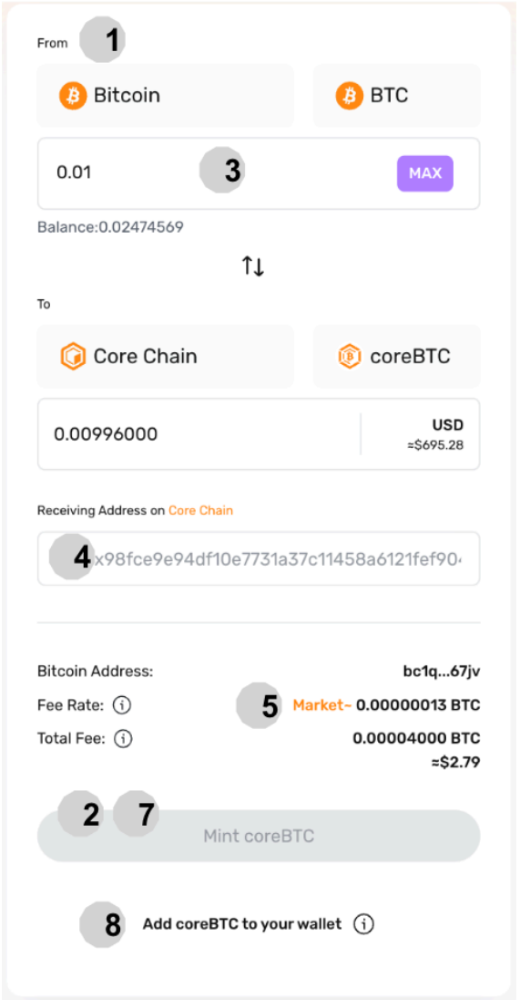
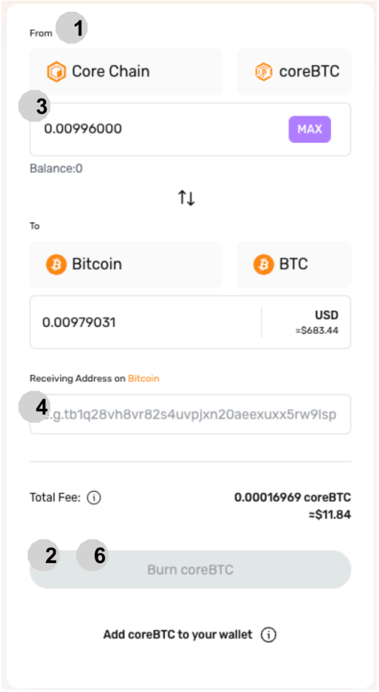
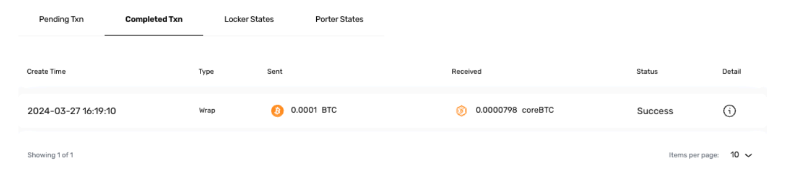

# Wrap & Unwrap coreBTC

### Introduction

As a native wrapped BTC on Core, coreBTC maintains a 1:1 peg with BTC through a secured and trustless mechanism, powered by a network of decentralized, permissionless participants. This guide covers the essential steps for minting (wrapping) and redeeming (unwrapping) coreBTC, facilitating Bitcoin integration into decentralized finance (DeFi).

<figure><figcaption></figcaption></figure>

### GettingStarted: Prerequisites

1. [**Unisat Wallet Browser Extension**](https://unisat.io/): Required for managing your BTC.

> **Note:** Unisat is currently supported on the desktop and has an Android wallet app.

2. **Metamask:** Necessary for interacting with the Core blockchain.

### Minting coreBTC

1. **coreBTC Website:** Go to [https://bridge.coredao.org/coreBTC](https://bridge.coredao.org/coreBTC)
2. **Specify Conversion:** Indicate you're converting from Bitcoin (BTC) to coreBTC.
3. **Connect Unisat Wallet:** Select _Connect Unisat Wallet_ to link your Bitcoin wallet.
4. **Enter BTC Amount:** Input the amount of BTC you wish to convert to coreBTC.
5. **Receiving Core Address:** Enter your Core blockchain wallet address.
6. **Adjust Fee Rate:** The default fees are set according to the current market rates. For faster transaction processing, it's essential to adjust the gas fee appropriately. Keep in mind that setting a higher fee can significantly speed up the transaction. Conversely, if the fee is set too low, the transaction may experience considerable delays in being mined, potentially taking days or even longer to process. It's crucial to find a balance that aligns with your urgency and the network's current demand.
7. **Verification:** Double-check all details, including amounts, fees, and wallet addresses.
8. **Mint:** Click on 'Mint coreBTC' to initiate the conversion.
9. **AddToken:** Select 'Add coreBTC to your wallet' in Metamask to view your coreBTC.

<figure><figcaption></figcaption></figure>

### Redeeming BTC from coreBTC

1. **coreBTC Website:** Go to [https://bridge.coredao.org/coreBTC](https://bridge.coredao.org/coreBTC)
2. **Specify Conversion:** Choose the conversion from coreBTC to Bitcoin (BTC).
3. **Connect EVM Wallet:** Click on _Connect EVM Wallet_ to link your wallet.
4. **Enter coreBTC Amount:** Specify the amount of coreBTC to be redeemed for BTC.
5. **Receiving Bitcoin Address:** Enter the destination Bitcoin wallet address.
6. **Verification:** Double-check all details, including amounts, fees, and wallet addresses.
7. **Burn:** Click on 'Burn coreBTC' to start the redemption process.

<figure><figcaption></figcaption></figure>

### Dashboard: Status Monitoring

<figure><figcaption></figcaption></figure>

* **Pending Transactions:** View and obtain details on ongoing transactions.
* **Completed Transactions:** Check the history and specifics of finalized transactions.
* **Locker States:** Explore available lockers, including their fees, collateral, minting capacity, and health factor. Lockers are crucial for securing BTC and are subject to penalties or liquidation based on behavior and collateral status.
* **Porter States:** Review the list of porters responsible for data transmission and verification between Bitcoin and Core blockchain.

> **Note:**\
> Refer to [coreBTC FAQs section](../../faqs/corebtc-faqs.md) for any queries that you may have.
